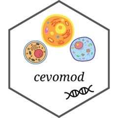
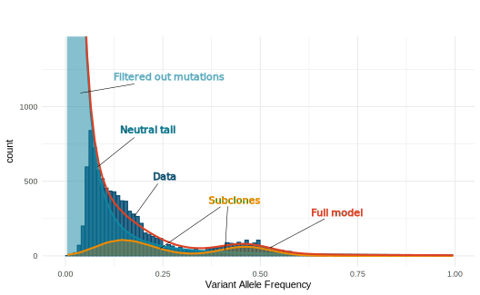

# cevomod 

<!-- badges: start -->
<!--[](https://lifecycle.r-lib.org/articles/stages.html#experimental) -->
[](https://github.com/pawelqs/cevomod/actions/workflows/R-CMD-check.yaml)
[](https://github.com/pawelqs/cevomod/actions/workflows/test-coverage.yaml)
<!-- badges: end -->


*cevomod* is a package that implements methods for analyzing cancer evolution from the Next Generation Sequencing data.

The modeling approach implemented in *cevomod* was inspired by the [MOBSTER](https://caravagnalab.github.io/mobster/index.html) package ([Caravagna et al., 2020](https://www.nature.com/articles/s41588-020-0675-5)), which models the distribution of Variant Allele Frequencies in the sample with a mixture of power-law-shaped and binomial distributions. However, MOBSTER fails to recognize the power-law component (the so-called neutral tail) in Whole Exome Sequencing data or data with insufficient sequencing coverage. cevomod implements methods that can fit the model to the data with significant loss of neutral tail variants.



In *cevomod*, the power-law and binomial components of the model are fitted sequentially. The power-law components are fitted first, and the binomial components are fitted to the residuals of the power-law components. There are two types of the power-law models: 

- with the power-law exponents equal to 2, as expected in the exponentially growing populations according to ([Durrett, 2013](https://pubmed.ncbi.nlm.nih.gov/23471293/)) and ([Williams et al., 2016](https://www.nature.com/articles/ng.3489)), 
- and with the power-law exponent that best fits the data. 

There are also several methods for fitting the clonal and subclonal components: 

- using Gaussian mixtures ([mclust](https://mclust-org.github.io/mclust/)) ([Scrucca et al., 2016](https://journal.r-project.org/archive/2016/RJ-2016-021/index.html)), 
- using binomial distributions ([BMix](https://github.com/caravagnalab/BMix)) ([Caravagna et al., 2020](https://www.nature.com/articles/s41588-020-0675-5)), 
- and by penalizing pairwise differences ([CliP](https://github.com/wwylab/CliP), via [Apptainer](https://apptainer.org/)) ([Jiang et al., 2021](https://www.biorxiv.org/content/10.1101/2021.03.31.437383v1)).

See the model fitting details in the [Get Started](https://pawelqs.github.io/cevomod/articles/get_started.html) and [Fitting models](https://pawelqs.github.io/cevomod/articles/fitting_models.html) vignettes.


## Installation

You can install the development version of cevomod from [GitHub](https://github.com/) with:

``` r
# install.packages("devtools")
devtools::install_github("pawelqs/cevomod")
```


## Last changes
* **v3.0.0** - cevodata package extracted from the original cevomod and imported by cevomod. cevomod responsible for modelling part only.
* **v2.3.0** - subclones can be fitted using [CliP](https://github.com/wwylab/CliP) ([Jiang et al., 2021](https://www.biorxiv.org/content/10.1101/2021.03.31.437383v1)) (`fit_subclones(method = "CliP")`). This option requires that the Apptainer is installed. CliP container image can be build with `build_clip_container()`
* **v2.2.0** - fit_powerlaw_tail_fixed() has a bootstrap option. See the details in [Fitting models #Bootstrapping](https://pawelqs.github.io/cevomod/articles/fitting_models.html#bootstrapping) vignette
* **v2.1.0** - cevomod is integrated with a helper [readthis](https://pawelqs.github.io/readthis/index.html) package, designed for bulk reading of variant files from algorithms such as Mutect2, Strelka, ASCAT, or FACETS, in the cevomod-friendly data format. Objects returned by `readthis::read_*()` functions can be added to the cevodata object using a general `add_data()` function.
* **v2.0.0** - Starting with version 2.0.0, cevomod can use either VAF or CCF (Cancer Cell Fraction) as a measure of mutation frequency. CCF is a measure of mutation frequency corrected for tumor purity and copy number alterations. CCF can be calculated prior to mutation frequency intervalization using the `calc_mutation_frequencies()` function and requires information on total copy number in tumor and normal tissue and sample purity (tumor cell content). See the Vignettes for more examples.

To see the previous changes in the package see the [Changelog](https://pawelqs.github.io/cevomod/news/index.html)


## Help and support

[GitHub Issues](https://github.com/pawelqs/cevomod/issues)

