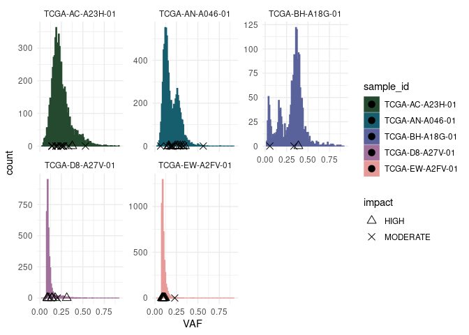

<!-- README.md is generated from README.Rmd. Please edit that file -->

# cevomod 

<!-- badges: start -->

[](https://lifecycle.r-lib.org/articles/stages.html#experimental)
[](https://github.com/pawelqs/cevomod/actions/workflows/R-CMD-check.yaml)
[](https://github.com/pawelqs/cevomod/actions/workflows/test-coverage.yaml)
<!-- badges: end -->

The goal of cevomod is to …

## Installation

You can install the development version of cevomod from
[GitHub](https://github.com/) with:

``` r
# install.packages("devtools")
devtools::install_github("pawelqs/cevomod")
```

## Example

This is a basic example which shows you how to solve a common problem:

``` r
library(cevomod)
library(tidyverse)
#> ── Attaching packages ─────────────────────────────────────── tidyverse 1.3.2 ──
#> ✔ ggplot2 3.3.6     ✔ purrr   0.3.4
#> ✔ tibble  3.1.8     ✔ dplyr   1.0.9
#> ✔ tidyr   1.2.0     ✔ stringr 1.4.1
#> ✔ readr   2.1.2     ✔ forcats 0.5.2
#> ── Conflicts ────────────────────────────────────────── tidyverse_conflicts() ──
#> ✖ dplyr::filter() masks stats::filter()
#> ✖ dplyr::lag()    masks stats::lag()
data("snvs_test")

snvs_test |> 
  ggplot(aes(VAF, fill = sample_id, color = sample_id)) +
  stat_SFS(geom = "bar") +
  layer_mutations(drivers = "BRCA", color = "black", shape = "impact") +
  facet_wrap(~sample_id, scales = "free_y") +
  theme_ellie(n = n_distinct(snvs_test$sample_id))
```


