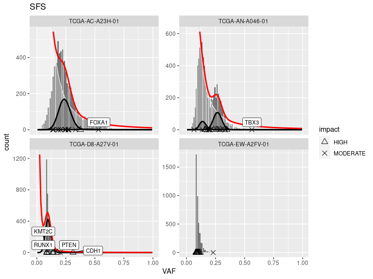

<!-- README.md is generated from README.Rmd. Please edit that file -->

# cevomod 

<!-- badges: start -->

[](https://lifecycle.r-lib.org/articles/stages.html#experimental)
[](https://github.com/pawelqs/cevomod/actions/workflows/R-CMD-check.yaml)
[](https://github.com/pawelqs/cevomod/actions/workflows/test-coverage.yaml)
<!-- badges: end -->

The goal of cevomod is to …

## Installation

You can install the development version of cevomod from
[GitHub](https://github.com/) with:

``` r
# install.packages("devtools")
devtools::install_github("pawelqs/cevomod")
```

## Example

This is a basic example which shows you how to solve a common problem:

``` r
library(cevomod)
#> 
#> Attaching package: 'cevomod'
#> The following object is masked from 'package:stats':
#> 
#>     filter
library(tidyverse)
#> ── Attaching packages
#> ───────────────────────────────────────
#> tidyverse 1.3.2 ──
#> ✔ ggplot2 3.4.0.9000     ✔ purrr   0.3.5     
#> ✔ tibble  3.1.8          ✔ dplyr   1.0.10    
#> ✔ tidyr   1.2.0          ✔ stringr 1.5.0     
#> ✔ readr   2.1.2          ✔ forcats 0.5.2     
#> ── Conflicts ────────────────────────────────────────── tidyverse_conflicts() ──
#> ✖ dplyr::filter() masks cevomod::filter(), stats::filter()
#> ✖ dplyr::lag()    masks stats::lag()
data("tcga_brca_test")

cd <- run_cevomod(tcga_brca_test)
```

``` r
plot_models(cd) +
  layer_mutations(cd, drivers = "BRCA")
#> Warning in geom_bar(aes(fill = .data$sample_id, width = .data$width), stat =
#> "identity", : Ignoring unknown aesthetics: width
#> Warning in ggrepel::geom_label_repel(aes(x = .data$VAF, shape
#> = .data[[shape]], : Ignoring unknown aesthetics: shape
#> Warning: ggrepel: 15 unlabeled data points (too many overlaps). Consider
#> increasing max.overlaps
#> Warning: ggrepel: 8 unlabeled data points (too many overlaps). Consider
#> increasing max.overlaps
#> Warning: ggrepel: 19 unlabeled data points (too many overlaps). Consider
#> increasing max.overlaps
#> Warning: ggrepel: 16 unlabeled data points (too many overlaps). Consider
#> increasing max.overlaps
```


